# Design Document

## Overview

The AI-Powered Sports Talent Assessment Platform follows a distributed architecture with edge computing capabilities. The system processes sports assessments locally on mobile devices for immediate feedback, then performs server-side verification for accuracy and integrity. The architecture emphasizes real-time performance, scalability, and data reliability.

## Architecture

### High-Level Architecture Diagram

```mermaid
flowchart LR
    A[👤 Athlete] --> B[📱 Mobile App<br/>Flutter + AI]
    B --> C[🌐 API Gateway<br/>Nginx]
    C --> D[⚙️ Backend Services<br/>Django + Celery]
    D --> E[🗄️ MongoDB<br/>Profiles & Results]
    D --> F[☁️ Object Storage<br/>S3/MinIO Videos]
    D --> G[📊 Admin Dashboard<br/>React/Next.js]
    D --> H[🔔 FCM Notifications]
    
    subgraph "Mobile Processing"
        B1[YOLOv8 Detection]
        B2[MediaPipe Poses]
        B3[OpenCV Analysis]
        B --> B1
        B --> B2
        B --> B3
    end
    
    subgraph "Backend Processing"
        D1[Redis Queue]
        D2[AI Verification]
        D3[Score Calculation]
        D --> D1
        D1 --> D2
        D2 --> D3
    end
```



### Component Flow

1. **Athlete Interaction**: Athletes use mobile app for assessments
2. **Edge Processing**: Real-time AI analysis on device using TensorFlow Lite
3. **Data Upload**: Results and videos sent to backend via API Gateway
4. **Server Verification**: Background processing with advanced AI models
5. **Data Storage**: Verified results stored in MongoDB, videos in object storage
6. **Dashboard Access**: Coaches access data through React-based admin interface
7. **Notifications**: Athletes receive updates via Firebase Cloud Messaging

### Level-1 Data Flow Diagram


### Athlete Journey Flowchart

```mermaid
flowchart TD
    A[👤 Athlete Opens App] --> B[Select Assessment Test<br/>Jump | Shuttle Run | Sit-ups | Endurance]
    B --> C[App Displays Guidelines<br/>+ Countdown Timer]
    C --> D[📹 Live Video Capture Starts]
    D --> E[🔬 On-Device AI Analysis]
    
    E --> E1[YOLO: Detects Athlete & Setup]
    E --> E2[MediaPipe: Extracts Pose Landmarks]
    E --> E3[OpenCV: Measures Time, Reps, Distance]
    
    E1 --> F[Generate Preliminary Result<br/>Jump Height | Reps | Run Time]
    E2 --> F
    E3 --> F
    
    F --> G[Results Preview<br/>+ Age/Gender Benchmark Comparison]
    G --> H[📤 Data Submission<br/>Video Clip + Metadata<br/>GPS Tag + Timestamp + Scores]
    
    H --> I[☁️ Backend Receives Data]
    I --> J[🔍 Server-Side Re-Verification<br/>YOLO + MediaPipe Analysis]
    J --> K[🗄️ Update Athlete Record<br/>MongoDB Storage]
    K --> L[📊 Update Leaderboards]
    L --> M[🔔 Push Notification<br/>Final Score to Athlete]
    
    style A fill:#e1f5fe
    style D fill:#fff3e0
    style E fill:#f3e5f5
    style I fill:#e8f5e8
    style M fill:#fff8e1
```

## Components and Interfaces

### Mobile Application (Flutter)

**Core Responsibilities:**
- Live video capture and streaming
- Real-time AI processing using TensorFlow Lite
- Offline data storage and synchronization
- User interface for test guidance and feedback

**Key Components:**
- **Camera Module**: Handles video capture with configurable resolution and frame rate
- **AI Processing Engine**: Integrates YOLOv8, MediaPipe, and OpenCV for real-time analysis
- **Local Storage**: SQLite database for offline result caching
- **Network Layer**: HTTP client with retry logic and offline queue management
- **UI Components**: Test selection, countdown timers, real-time feedback displays

**Interfaces:**
```dart
abstract class AIProcessor {
  Future<AssessmentResult> processFrame(VideoFrame frame);
  Stream<RealTimeFeedback> getRealTimeFeedback();
}

abstract class AssessmentRepository {
  Future<void> saveResult(AssessmentResult result);
  Future<List<AssessmentResult>> getPendingUploads();
  Future<void> syncWithServer();
}
```

### API Gateway (Nginx)

**Core Responsibilities:**
- Request routing and load balancing
- Rate limiting and security enforcement
- SSL termination and compression
- Static file serving for dashboard assets

**Configuration:**
- Upstream servers for Django backend
- WebSocket proxy for real-time features
- File upload limits for video content
- CORS configuration for web dashboard

### Backend Services (Django + Django REST Framework)

**Core Responsibilities:**
- Business logic and API endpoints
- User authentication and authorization
- Assessment workflow orchestration
- Data validation and integrity checks

**Key Models:**
```python
class Athlete(models.Model):
    user = models.OneToOneField(User)
    profile_data = models.JSONField()
    created_at = models.DateTimeField(auto_now_add=True)

class Assessment(models.Model):
    athlete = models.ForeignKey(Athlete)
    test_type = models.CharField(max_length=50)
    preliminary_score = models.FloatField()
    final_score = models.FloatField(null=True)
    status = models.CharField(max_length=20)
    video_url = models.URLField()
    metadata = models.JSONField()
    created_at = models.DateTimeField(auto_now_add=True)
```

**API Endpoints:**
- `POST /api/assessments/` - Submit new assessment
- `GET /api/assessments/{id}/` - Retrieve assessment details
- `GET /api/leaderboards/` - Get leaderboard data
- `POST /api/auth/login/` - User authentication

### Background Processing (Celery + Redis)

**Core Responsibilities:**
- Asynchronous task processing
- AI model execution for verification
- Video processing and analysis
- Notification dispatch

**Task Types:**
```python
@shared_task
def verify_assessment(assessment_id):
    # Server-side AI verification
    pass

@shared_task
def process_video(video_url, assessment_id):
    # Video analysis and clip extraction
    pass

@shared_task
def update_leaderboards(athlete_id):
    # Recalculate rankings
    pass
```

### Data Storage

**MongoDB Collections:**
- **athletes**: User profiles and metadata
- **assessments**: Test results and scores
- **leaderboards**: Ranking data by sport/category
- **notifications**: Message history and delivery status

**Object Storage Structure:**
```
/videos/
  /{athlete_id}/
    /{assessment_id}/
      /original.mp4
      /proof_clips/
        /technique_analysis.mp4
        /timing_verification.mp4
```

### Admin Dashboard (React/Next.js)

**Core Responsibilities:**
- Data visualization and analytics
- Athlete profile management
- Assessment review and verification
- Report generation and export

**Key Components:**
- **Dashboard Overview**: Performance metrics and system health
- **Athlete Management**: Search, filter, and profile views
- **Assessment Review**: Video playback with AI analysis overlay
- **Analytics Engine**: Charts, heatmaps, and trend analysis
- **Export Tools**: PDF reports and CSV data downloads

## Data Models

### Assessment Data Flow


### AI Processing Pipeline

**On-Device Processing:**
1. **YOLOv8**: Object detection for equipment validation and cheat detection
2. **MediaPipe**: Pose estimation for technique analysis and joint angle measurement
3. **OpenCV**: Timing analysis, distance measurement, and repetition counting

**Server-Side Verification:**
1. **Enhanced YOLO Models**: More accurate object detection with larger model sizes
2. **Advanced OpenCV**: Sophisticated video analysis and motion tracking
3. **Integrity Checks**: Cross-validation between on-device and server results

## Error Handling

### Mobile Application
- **Network Failures**: Automatic retry with exponential backoff
- **AI Processing Errors**: Graceful degradation with user notification
- **Storage Limitations**: Automatic cleanup of old cached data
- **Camera Issues**: Error recovery and alternative input methods

### Backend Services
- **Database Failures**: Connection pooling and automatic failover
- **Processing Errors**: Dead letter queues for failed tasks
- **Storage Issues**: Redundant storage with automatic replication
- **API Errors**: Structured error responses with proper HTTP status codes

### Data Consistency
- **Eventual Consistency**: Offline-first approach with conflict resolution
- **Validation Layers**: Input validation at API and database levels
- **Audit Trails**: Complete logging of all data modifications
- **Backup Strategies**: Automated backups with point-in-time recovery

## Testing Strategy

### Unit Testing
- **Mobile**: Flutter widget tests and unit tests for AI processing logic
- **Backend**: Django model tests and API endpoint testing
- **AI Models**: Accuracy testing with known datasets

### Integration Testing
- **API Testing**: End-to-end API workflow testing
- **Database Testing**: Data integrity and performance testing
- **Storage Testing**: File upload/download and consistency testing

### Performance Testing
- **Load Testing**: Concurrent user simulation and stress testing
- **AI Performance**: Model inference time and accuracy benchmarking
- **Mobile Performance**: Battery usage and processing efficiency testing

### Security Testing
- **Authentication**: JWT token validation and session management
- **Authorization**: Role-based access control testing
- **Data Protection**: Encryption at rest and in transit validation
- **Input Validation**: SQL injection and XSS prevention testing